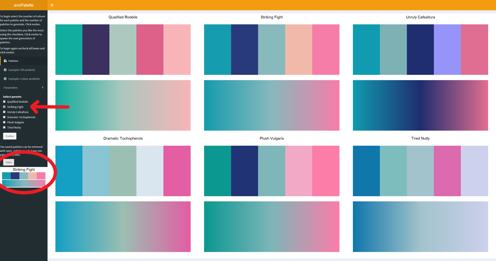

<!-- README.md is generated from README.Rmd. Please edit that file -->

# evoPalette

evoPalette allows for the discovery and generation of new colour
palettes for R. Taking user input it uses a genetic algorithm to spawn
new palettes. This can be repeated as many times as needed to generate
the desired palette.

## Installation

``` r
devtools::install_github("doehm/evoPalette")
```

## Getting started

To jump straight into it launch the Shiny app with

``` r
launch_evo_palette()
```

To generate the first set of palettes, click ‘evolve’.

<center>


</center>

Select one or more palettes that you like and think may work well
together from the check box and click ‘evolve’.

<center>


</center>

The next generation of palettes will be created. Continue until you are
happy with a palette.With each generation you’ll notice how the palette
is converging to a similar theme based on your selections, along with
some variation of each individual colour and a chance of a completely
random mutation. Selecting only a single parent is convenient to
generate minor variations on a single palette to tweak the colours.

<center>


</center>

Select ‘Example: Fill aesthetic’ to see how the palette works in
practice.

<center>


</center>

To save a palette, select the desired palette from the check box and
click ‘save’. The palette is now accessible from
<code>palette\_box()</code> once the app is closed. You can save
multiple palettes which will be collected in the palette box. The
palette box will be refreshed when starting a new session so remember to
save it to disk.

<center>



</center>

``` r
palette_box()
#> $`Striking Fight`
#> [1] "#169CAF" "#283A7B" "#87B9BD" "#F1B9AA" "#F77DA9"
```

To begin again, deselect all palettes and click ‘evolve’. A new set of
randomly selected palettes will be shown.

## Control

Select the parameters from the drop down in the menu.

<center>


</center>

  - Number of colours to generate for each palette
  - Number of palettes to generate at each evolution
  - Mutation rate - Each colour in the palette has a probability of
    random mutation equal to this value (default p = 0.05)
  - Mutation variation - Each colour will vary slightly around it’s
    original value e.g. like a child not being the same height as either
    of their parents.
  - Load an existing palette from the global environment. Object should
    be list, ideally with names.

When you are happy with your selections, click ‘evolve’

## Acknowledgments

The package uses [paletteer](https://github.com/EmilHvitfeldt/paletteer)
to initialise the palette selection. It is a collection of colour
palettes that exist across multiple packages in R.
