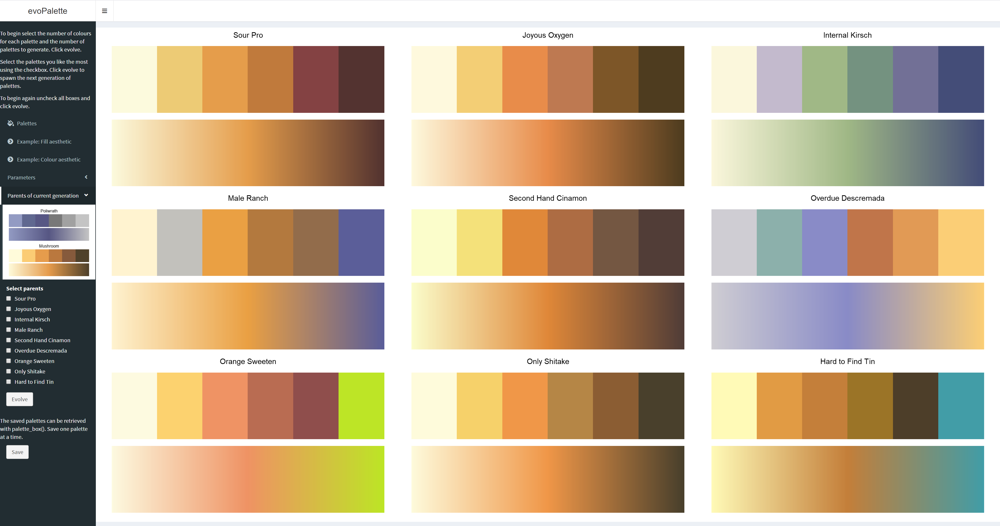
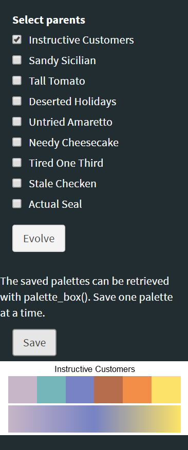
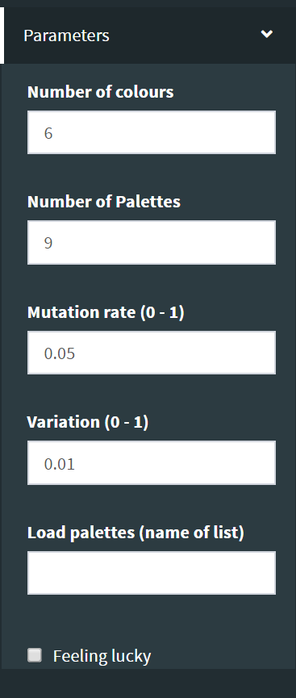

<!-- README.md is generated from README.Rmd. Please edit that file -->

# evoPalette

evoPalette allows for the discovery and generation of new colour
palettes for R. Taking user input it uses a genetic algorithm to spawn
new palettes. This can be repeated as many times as needed to generate
the desired palette.

## Installation

``` r
devtools::install_github("doehm/evoPalette")
```

## Getting started

To jump straight into it launch the Shiny app with

``` r
launch_evo_palette()
```

To generate the first set of palettes, click ‘evolve’.

<center>


</center>

Select one or more palettes that you like and think may work well
together from the check box and click ‘evolve’.

<center>


</center>

The next generation of palettes will be created. Continue until you are
happy with a palette.With each generation you’ll notice how the palette
is converging to a similar theme based on your selections, along with
some variation of each individual colour and a chance of a completely
random mutation.

<center>



</center>

Selecting only a single parent is convenient to generate minor
variations on a single palette to tweak the colours. Random names are
given to each new palette.

<center>


</center>

Select ‘Example: Fill aesthetic’ to see how the palette works in
practice.

<center>


</center>

To save a palette, select the desired palette from the check box and
click ‘save’. A box will appear giving the opportunity to change the
palette name. The palette is now accessible from
<code>palette\_box()</code> once the app is closed. You can save
multiple palettes which will be collected in the palette box. The
palette box will be refreshed when starting a new session so remember to
save it to disk.

<center>



</center>

``` r
palette_box()
#> $striking_almondmilk
#> [1] "#F2EA91" "#5B95AA" "#2B78A7" "#3C4519" "#665859" "#BB6A70"
```

To begin again, deselect all palettes and click ‘evolve’. A new set of
randomly selected palettes will be shown.

## Control

Select the parameters from the drop down in the menu.

<center>



</center>

  - Number of colours to generate for each palette
  - Number of palettes to generate at each evolution
  - Mutation rate - Each colour in the palette has a probability of
    random mutation equal to this value (default p = 0.05)
  - Mutation variation - Each colour will vary slightly around it’s
    original value.
  - Load existing palettes from the global environment. Object should be
    list, ideally with names i.e. the same format as
    <code>palette\_box()</code>.
  - Are you feeling lucky? Select for generating palettes from
    completely random colours.

When you are happy with your selections, click ‘evolve’

## Scales

The generated colour palettes can easily be added to ggplots using the
scale functions  and .

``` r
library(ggplot2)
mpg %>% 
  ggplot(aes(x = displ, fill = class)) +
  geom_histogram() +
  scale_fill_evo("striking_almondmilk")
```

<center>


</center>

If no name is given the first palette in the list will be used.

## Acknowledgments

The package uses [paletteer](https://github.com/EmilHvitfeldt/paletteer)
to initialise the palette selection. It is a collection of colour
palettes that exist across multiple packages in R. This package would
not work as well without it’s help.
